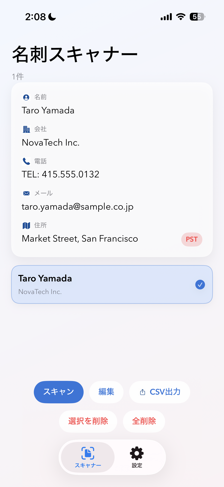
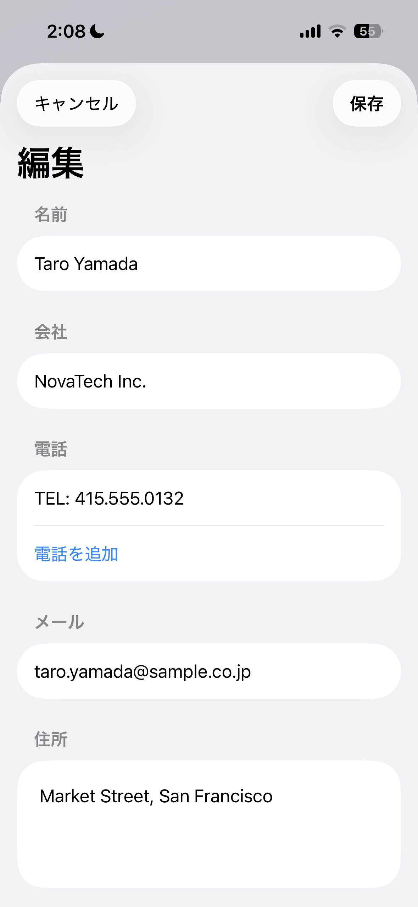

# BCS - Business Card Scanner

名刺をカメラで撮影するだけで、氏名・会社・電話・メール・住所を自動抽出する iOS アプリです。
Apple の Vision フレームワークを用いた OCR と、独自のパーサーパイプラインを組み合わせることで、レイアウトが異なる名刺にも高精度で対応します。

---

## 主な機能

| 機能 | 概要 |
|------|------|
| 名刺スキャン | VNDocumentCameraViewController でカメラ撮影 → Vision OCR でテキスト認識 |
| 自動情報抽出 | 氏名・会社・電話・メール・住所をスコアリングベースで自動分類 |
| タイムゾーン推定 | 米国住所の郵便番号 / 市外局番から PST・MST・CST・EST を自動判定 |
| 手動編集 | スキャン結果を Form UI で修正可能。Cancel で変更を破棄、Save で確定 |
| CSV 出力 | RFC 4180 / UTF-8 BOM 形式で全カードを一括エクスポート（Excel・Numbers 対応） |
| 日英対応 | システム言語に合わせて UI を日本語 / 英語で自動切替 |
| 削除 Undo | 削除後 6 秒以内であればワンタップで復元。カード行スワイプでも削除可 |
| OCR フィードバック | テキスト未検出・カメラエラー時にアラートで通知。処理中はオーバーレイで進捗表示 |

---

## スクリーンショット

| カード一覧 | スキャン中 | 編集画面 |
|:-----------:|:---------:|:--------:|
|  |  |  |

---

## 技術スタック

- **言語**: Swift 5.10
- **UI**: SwiftUI
- **OCR**: Vision / VisionKit (`VNRecognizeTextRequest`)
- **カメラ**: `VNDocumentCameraViewController`
- **並行処理**: Swift Concurrency（`async/await`、`Task.detached`）
- **永続化**: Documents ディレクトリ（JSON ファイル・アトミック書き込み）
- **最小 iOS**: 17.0

---

## アーキテクチャ

```
BCSApp
└── RootView (TabView)
    ├── ContentView          # カード一覧・操作 UI
    │   ├── ScannerView      # カメラ → OCR → パース起動
    │   └── EditCardView     # 手動編集
    └── SettingsView         # 言語設定

パーサーパイプライン（ScannerView.Coordinator 内）
  OCR テキスト群
    → AddressParser    住所ブロック検出・マルチライン結合
    → PhoneParser      電話番号抽出・ラベル付与・重複除去
    → NameParser       スコアリングによる人名候補選定

共通ユーティリティ
  ParserUtils.swift    normalizeSpace / isJobTitleLine / containsContactKeyword
  TimeZoneResolver     ZIP・市外局番 → タイムゾーン変換（非同期）
  Models.swift         ZipTimeZoneDB / AreaCodeTimeZoneDB（CSV 遅延ロード）
```

---

## 技術的なこだわり

### 1. OCR 後の多段パーサーパイプライン

Vision OCR が返すテキストは座標付きの断片の集合です。このアプリでは以下の順で処理します。

1. **行の再構築** — Y 座標・X 座標を基に断片を行に統合し、列のギャップも検出
2. **住所検出** — `NSDataDetector` + 正規表現 + スコアリングで住所ブロックを特定。連続する行を縦方向にマージし、インデントされた続行行も回収
3. **電話番号抽出** — 正規表現 2 パターン + `NSDataDetector` で二重取得し、ラベル（TEL / Mobile / Direct）と数字を対応付け
4. **人名選定** — 文字高さ・Y 座標・TitleCase 判定・メールアドレスのヒントなどを総合したスコアで候補をランキング

### 2. タイムゾーン推定の非同期化

米国郵便番号 DB（`uszips.csv`・数万行）は起動時にバックグラウンドでプリロードします。
タイムゾーン解決処理は `Task.detached` でメインスレッドを解放し、結果を `MainActor` で UI に反映します。

```swift
Task {
    let updates = await Task.detached(priority: .utility) {
        TimeZoneResolver.resolveUpdates(for: snapshot) // CSV lookup はここ（バックグラウンド）
    }.value
    // ここは MainActor — @State への書き込みが安全
    for update in updates { ... }
}
```

### 3. スレッドセーフな遅延ロード DB

`ZipTimeZoneDB` / `AreaCodeTimeZoneDB` は専用の `DispatchQueue` で CSV の読み込みと参照を保護します。
`preload()` は非同期で先読みを開始し、初回アクセス時に未完了であれば `queue.sync` で待機します。

```swift
func timeZoneIdentifier(for zip: String) -> String? {
    queue.sync {          // 読み込み完了を保証しつつスレッドセーフに参照
        loadIfNeeded()
        return map[zip]
    }
}
```

### 4. 重複コードの排除

リファクタリングにより、4 ファイルに重複していた `normalizeSpace` などのユーティリティ関数を `ParserUtils.swift` に一元化。タイムゾーン解決ロジック（旧 ContentView 内 ~80 行）は `TimeZoneResolver.swift` に分離し、ContentView の責務を UI に限定しました。

---

## ファイル構成

```
BCS/
├── BCSApp.swift            エントリーポイント
├── RootView.swift          TabView ルート
├── ContentView.swift       カード一覧・Undo・エクスポート
├── EditCardView.swift      カード手動編集
├── SettingsView.swift      言語設定
├── ScannerView.swift       OCR + パーサー起動
├── AddressParser.swift     住所ブロック検出・結合
├── PhoneParser.swift       電話番号抽出・ラベル付与
├── NameParser.swift        人名スコアリング
├── ParserUtils.swift       パーサー共通ユーティリティ
├── TimeZoneResolver.swift  タイムゾーン解決（非同期）
├── Models.swift            データモデル・CSV DB
├── AppSettings.swift       言語設定の永続化
├── L10n.swift              日英ローカライズ
├── OCRTypes.swift          OCRItem / OCRLine 型定義
├── ShareSheet.swift        UIActivityViewController ラッパー
├── uszips.csv              米国郵便番号 → タイムゾーン DB
└── ac-tz.csv               米国市外局番 → タイムゾーン DB
```

---

## セットアップ

```bash
git clone https://github.com/shu8719/BCS.git
cd BCS
open BCS.xcodeproj
```

Xcode でスキームを選択し、実機または Simulator でビルドしてください。
カメラを使用するため、実機での動作を推奨します。

> **Required**: Xcode 16+ / iOS 17+

---

## 今後の改善案

- [ ] OCR 言語設定の追加（日本語名刺対応）
- [ ] ダークモード対応
- [ ] パーサーのユニットテスト追加
- [ ] SwiftData への移行
